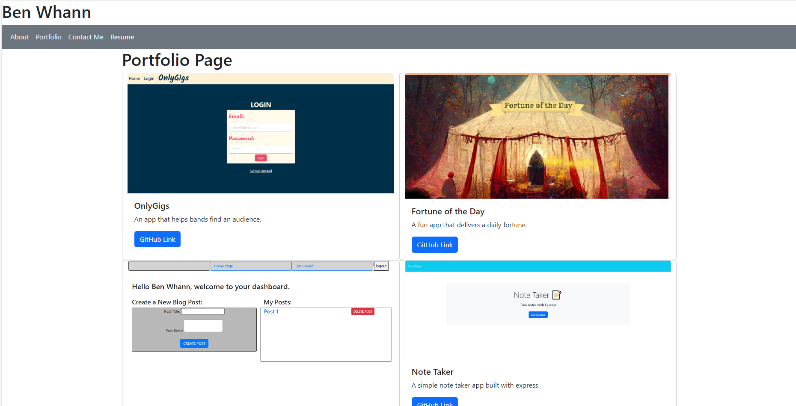

# Updated Project Portfolio

## Description

This is an updated version of my project portfolio that was built with react.

## Link to deployment

https://main--elaborate-semifreddo-ebfe16.netlify.app/portfolio

## Assets

## Usage

This is to display my work. All you can do is look at it.

## License

This application is covered by the MIT license.
